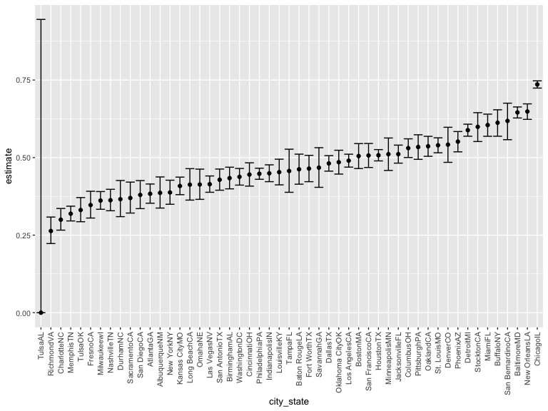
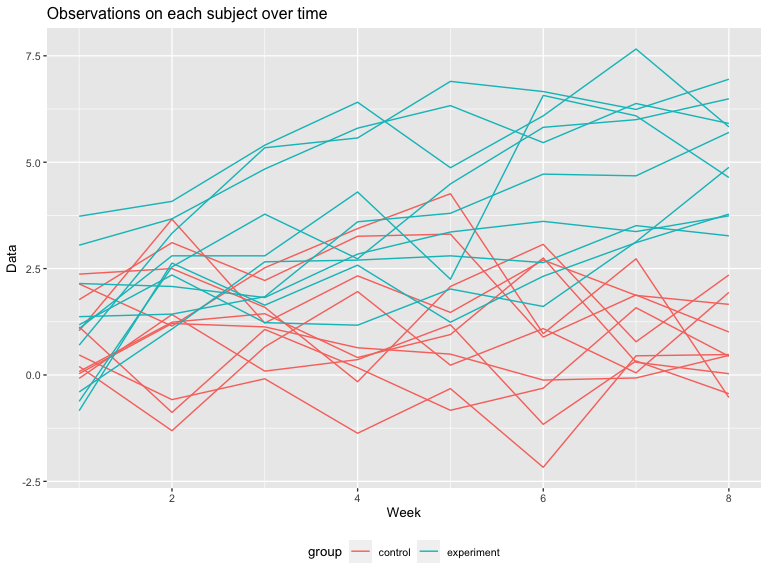

hw5
================
Huili Zheng
11/20/2021

## Probelm 1

``` r
homicide_df = 
  read_csv("./homicide-data.csv", na = c("","Unknown")) %>%
  mutate(
    city_state = str_c(city, state),
    resolution = case_when(
      disposition == "Closed without arrest" ~ "unsolved",
      disposition == "Open/No arrest" ~ "unsolved",
      disposition == "Closed by arrest" ~ "solved"
    )
  ) %>%
  relocate(city_state) %>%
  filter(city != "TulsaAL")
```

Let’s focus on Baltimore, MD.

``` r
baltimore_df = 
  homicide_df %>%
  filter(city_state == "BaltimoreMD")

baltimore_summary = 
  baltimore_df %>%
  summarize(
    unsolved = sum(resolution == "unsolved"),
    n = n()
  )

baltimore_test = 
  prop.test(x = baltimore_summary %>% pull(unsolved), n = baltimore_summary %>% pull(n))

baltimore_test %>%
  broom::tidy()
```

    ## # A tibble: 1 × 8
    ##   estimate statistic  p.value parameter conf.low conf.high method    alternative
    ##      <dbl>     <dbl>    <dbl>     <int>    <dbl>     <dbl> <chr>     <chr>      
    ## 1    0.646      239. 6.46e-54         1    0.628     0.663 1-sample… two.sided

Let’s try to iterate across cities.

First off, write a function and test some cities.

``` r
prop_test_function = function(city_df){
  
  city_summary = 
    city_df %>%
    summarize(
      unsolved = sum(resolution == "unsolved"),
      n = n()
    )
  
  city_test = 
    prop.test(
      x = city_summary %>% pull(unsolved),
      n = city_summary %>% pull(n)
    )
  return(city_test)
}

prop_test_function(baltimore_df)
```

    ## 
    ##  1-sample proportions test with continuity correction
    ## 
    ## data:  city_summary %>% pull(unsolved) out of city_summary %>% pull(n), null probability 0.5
    ## X-squared = 239.01, df = 1, p-value < 2.2e-16
    ## alternative hypothesis: true p is not equal to 0.5
    ## 95 percent confidence interval:
    ##  0.6275625 0.6631599
    ## sample estimates:
    ##         p 
    ## 0.6455607

``` r
homicide_df %>%
  filter(city_state == "AlbuquerqueNM") %>%
  prop_test_function()
```

    ## 
    ##  1-sample proportions test with continuity correction
    ## 
    ## data:  city_summary %>% pull(unsolved) out of city_summary %>% pull(n), null probability 0.5
    ## X-squared = 19.114, df = 1, p-value = 1.232e-05
    ## alternative hypothesis: true p is not equal to 0.5
    ## 95 percent confidence interval:
    ##  0.3372604 0.4375766
    ## sample estimates:
    ##         p 
    ## 0.3862434

Iterate across all cities.

``` r
results_df =
  homicide_df %>%
  nest(data = uid:resolution) %>%
  mutate(
    test_results = map(data, prop_test_function),
    tidy_results = map(test_results, broom::tidy)
  ) %>%
  select(city_state, tidy_results) %>%
  unnest(tidy_results) %>%
  select(city_state, estimate, starts_with(("conf")))
```

Try to make a plot showing estimates and confidence intervals.

``` r
results_df %>%
  mutate(city_state = fct_reorder(city_state, estimate)) %>%
  ggplot(aes(x = city_state, y = estimate)) +
  geom_point() +
  geom_errorbar(aes(ymin = conf.low,  ymax = conf.high)) +
  theme(axis.text.x = element_text(angle = 90, vjust = 0.5, hjust = 1))
```



``` r
homicide_df %>%
  group_by(city_state) %>%
  summarize(
    unsolved = sum(resolution == "unsolved"),
    n = n()
  ) %>%
  mutate(
    test_results = map2(unsolved,n,prop.test), 
    tidy_results = map(test_results, broom::tidy)
  ) %>%
  select(city_state, tidy_results) %>%
  unnest(tidy_results) %>%
  select(city_state, estimate, starts_with("conf"))
```

    ## # A tibble: 51 × 4
    ##    city_state    estimate conf.low conf.high
    ##    <chr>            <dbl>    <dbl>     <dbl>
    ##  1 AlbuquerqueNM    0.386    0.337     0.438
    ##  2 AtlantaGA        0.383    0.353     0.415
    ##  3 BaltimoreMD      0.646    0.628     0.663
    ##  4 Baton RougeLA    0.462    0.414     0.511
    ##  5 BirminghamAL     0.434    0.399     0.469
    ##  6 BostonMA         0.505    0.465     0.545
    ##  7 BuffaloNY        0.612    0.569     0.654
    ##  8 CharlotteNC      0.300    0.266     0.336
    ##  9 ChicagoIL        0.736    0.724     0.747
    ## 10 CincinnatiOH     0.445    0.408     0.483
    ## # … with 41 more rows

## Problem 2

Read in and tidy the datasets:

``` r
p2_df =
  tibble(
    file_name = list.files(path = './data', full.names = TRUE),
    data = map(file_name, ~read_csv(.)),
    group = case_when(
      file_name %>% str_detect("con") ~ "control",
      file_name %>% str_detect("exp") ~ "experiment",
    ),
    id = as.numeric(str_extract_all(file_name, "[0-9]+"))
  ) %>% 
  unnest(cols = c(data)) %>% 
  pivot_longer(
    week_1:week_8,
    names_to = "week",
    values_to = "value"
  ) %>% 
  mutate(
    id = paste(group, "_", as.character(id), sep = ""),
    week = as.numeric(str_extract_all(week, "[0-9]+"))
  ) %>% 
  select(group, id, week, value)
p2_df
```

    ## # A tibble: 160 × 4
    ##    group   id         week value
    ##    <chr>   <chr>     <dbl> <dbl>
    ##  1 control control_1     1  0.2 
    ##  2 control control_1     2 -1.31
    ##  3 control control_1     3  0.66
    ##  4 control control_1     4  1.96
    ##  5 control control_1     5  0.23
    ##  6 control control_1     6  1.09
    ##  7 control control_1     7  0.05
    ##  8 control control_1     8  1.94
    ##  9 control control_2     1  1.13
    ## 10 control control_2     2 -0.88
    ## # … with 150 more rows

A spaghetti plot showing observations on each subject over time:

``` r
p2_df %>% 
  ggplot(aes(x = week, y = value, group = id, color = group)) +
  geom_line() +
  xlab("Week") +
  ylab("Data")
```



*Comments:* The values of the experiment group increase over time and
the overall values of experiment group are larger than those of control
group after 6 weeks.

## Problem3

First we read the dataset with missing values.

``` r
set.seed(10)
iris_with_missing = iris %>% 
  map_df(~replace(.x, sample(1:150, 20), NA)) %>%
  mutate(Species = as.character(Species))
```

Then we create a function called `fill_NA`, which will take a vector as
an argument, detect the input variable type and then fill missing values
with the rules defined in the question.

``` r
fill_na = function(x){
  
  if (class(x) == "numeric") {
    return(replace_na(x, mean(x, na.rm = TRUE)))
  } else if (class(x) == "character") {
    return(replace_na(x, "virginica")) 
  }
}
```

Lastly, apply this function to the columns of dataset using a map
statement.

``` r
output = map_df(iris_with_missing, fill_na)
output
```

    ## # A tibble: 150 × 5
    ##    Sepal.Length Sepal.Width Petal.Length Petal.Width Species
    ##           <dbl>       <dbl>        <dbl>       <dbl> <chr>  
    ##  1         5.1          3.5         1.4         0.2  setosa 
    ##  2         4.9          3           1.4         0.2  setosa 
    ##  3         4.7          3.2         1.3         0.2  setosa 
    ##  4         4.6          3.1         1.5         1.19 setosa 
    ##  5         5            3.6         1.4         0.2  setosa 
    ##  6         5.4          3.9         1.7         0.4  setosa 
    ##  7         5.82         3.4         1.4         0.3  setosa 
    ##  8         5            3.4         1.5         0.2  setosa 
    ##  9         4.4          2.9         1.4         0.2  setosa 
    ## 10         4.9          3.1         3.77        0.1  setosa 
    ## # … with 140 more rows
