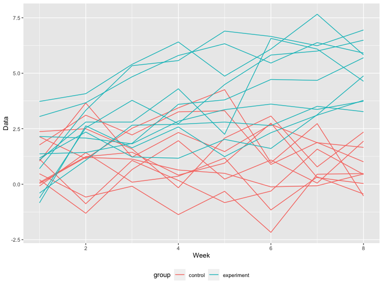

hw5
================
Huili Zheng
11/20/2021

## Problem 2

Read in and tidy the datasets:

``` r
p2_df =
  tibble(
    file_name = list.files(path = './data', full.names = TRUE),
    data = map(file_name, ~read_csv(.)),
    group = case_when(
      file_name %>% str_detect("con") ~ "control",
      file_name %>% str_detect("exp") ~ "experiment",
    ),
    id = as.numeric(str_extract_all(file_name, "[0-9]+"))
  ) %>% 
  unnest(cols = c(data)) %>% 
  pivot_longer(
    week_1:week_8,
    names_to = "week",
    values_to = "value"
  ) %>% 
  mutate(
    id = paste(group, "_", as.character(id), sep = ""),
    week = as.numeric(str_extract_all(week, "[0-9]+"))
  ) %>% 
  select(group, id, week, value)
p2_df
```

    ## # A tibble: 160 × 4
    ##    group   id         week value
    ##    <chr>   <chr>     <dbl> <dbl>
    ##  1 control control_1     1  0.2 
    ##  2 control control_1     2 -1.31
    ##  3 control control_1     3  0.66
    ##  4 control control_1     4  1.96
    ##  5 control control_1     5  0.23
    ##  6 control control_1     6  1.09
    ##  7 control control_1     7  0.05
    ##  8 control control_1     8  1.94
    ##  9 control control_2     1  1.13
    ## 10 control control_2     2 -0.88
    ## # … with 150 more rows

A spaghetti plot showing observations on each subject over time:

``` r
p2_df %>% 
  ggplot(aes(x = week, y = value, group = id, color = group)) +
  geom_line() +
  xlab("Week") +
  ylab("Data")
```



*Comments:* The values of the experiment group increase over time and
the overall values of experiment group are larger than those of control
group after 6 weeks.
